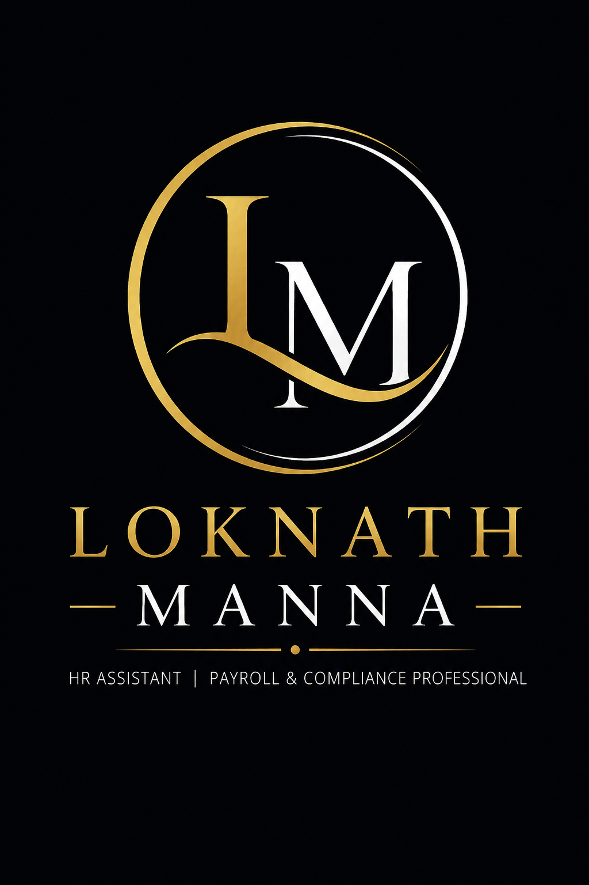

# 🌟 Loknath Manna Portfolio Website

A modern, responsive, and animated personal portfolio website for *Loknath Manna*, designed with a premium black and gold theme inspired by the reference design.

## 👨‍💼 About

This portfolio showcases:

- Professional Summary
- Skills & Expertise
- Education
- Experience & Certifications
- Languages
- Hobbies
- Contact Information
- LinkedIn Profile
- Downloadable Resume

## ✨ Features

- 🎨 Premium Black & Gold UI
- 📱 Fully Responsive Design
- ⚡ Smooth Scroll Animations
- 🌟 Interactive Hover Effects
- 📄 Resume Download Button
- 🔗 LinkedIn Integration
- 🖥️ Modern One-Page Portfolio Layout
- 🚀 Free Deployment Support

## 🛠️ Built With

- HTML5
- CSS3
- JavaScript (Vanilla)
- Font Awesome
- Google Fonts

## 📂 Project Structure

text
loknath-portfolio/
│
├── index.html
├── style.css
├── script.js
├── README.md
│
└── assets/
    ├── logo.png
    └── resume.pdf

## 🚀 Getting Started

### Clone the Repository

bash
git clone https://github.com/your-username/loknath-portfolio.git

### Open the Project

Simply open:

text
index.html

in your browser.

No additional setup or dependencies are required.

## 🌐 Free Hosting

You can host this website for free using:

- GitHub Pages
- Netlify
- Vercel
- Cloudflare Pages

### GitHub Pages Deployment

1. Push the project to GitHub.
2. Open *Settings → Pages*.
3. Select:

text
Deploy from a branch → main → /(root)

4. Click *Save*.

Your website will be live in a few minutes.

## 📞 Contact

*Loknath Manna*

📧 Email: loknathmanna23@gmail.com

📱 Phone: +91 8371998589

📍 Kolkata, India

🔗 LinkedIn:

https://www.linkedin.com/in/loknath-manna-b84207365

## 📜 License

This project is licensed under the MIT License.

---

⭐ If you like this project, please consider giving it a star on GitHub!
